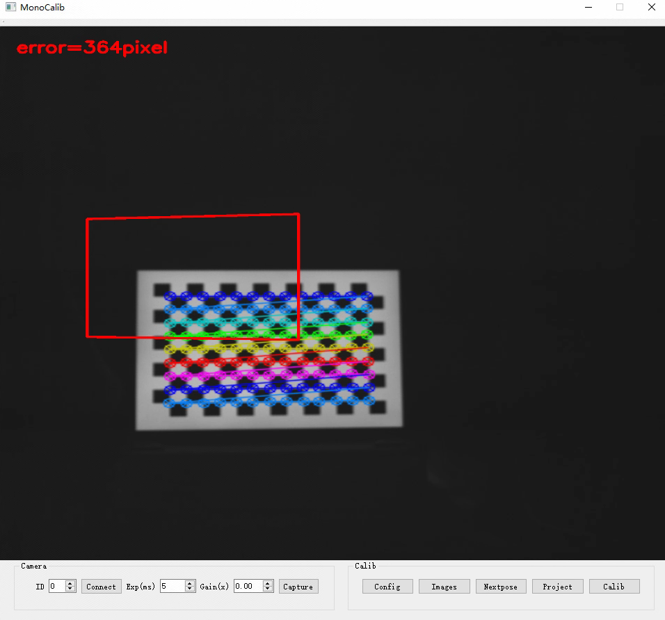
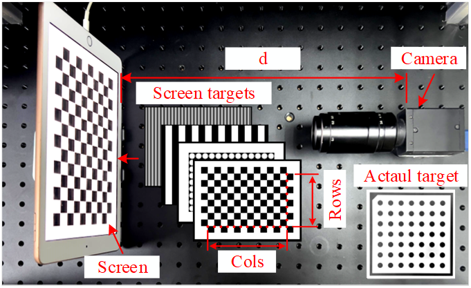
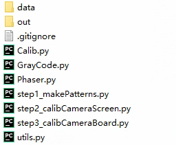
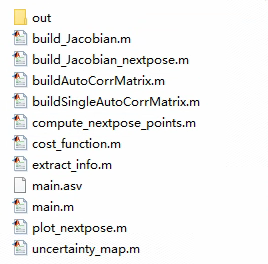

# A visual guidance calibration method for out-of-focus camera based on iterative phase target

This responsory is the code of the paper **“A visual guidance calibration method for out-of-focus camera based on iterative phase target”**. 

The innovation of this paper is that the defocus error and singularity of the solution are considered together compared with the previous works. But it is also more time consuming and sensitive to ambient light by adopting phase-shift targets.

Fig.1 shows the comparison of calibration results between screen-targets under different distances, and can be found that it (phase-iter) is robustness to defocus for camera calibration whether the working distance changed from d1 to d3. 

|        |
| :----------------------------------------------------------: |
| Fig.1 Comparison of calibration results between screen-targets under different distances: d1(focused), d2(defocused-slight), d3(defocused-severe). |

## Usage

A GUI program is provided as follows:

|  |
| :----------------------------------------------------: |
| Fig.2 The GUI interference of our calibration program. |

The experiment settings contains an industry camera (model: FlyCapture GS3-U3-41C6C) with a resolution of  2048 \times 2048 and an `iPad2018`with a resolution of 2048 \times 1536 as follows:

|        |
| :----------------------------------------------------------: |
| Fig. 3 Experiment equipment: a mono-camera and an iPad screen, and their distance d can be changed by the screen moving. |

- The camera is connected with the C++ SDK provided by the PointGray company, thus in theory, it only needs to be a camera which supported by the driver `flycapture2`, and it can be connected directly after the environment is configured.
- The `iPad2018` is connected by the software `Duet Dispky`, which is applied to extend iPad as an extended screen. Note: Although it is charged, its display effect is the best compared to other same-screen software.

Let's us to explain how to use our code:

1. Download the code, and to config the environment of VS2015、OpenCV3X、QT5.12.X and Flycapture2. 

   - VS2015: to download in the URL: https://visualstudio.microsoft.com/vs/older-downloads/
   - OpenCV: to download 3.4X version in the URL: https://sourceforge.net/projects/opencvlibrary/files/3.4.15/opencv-3.4.15-vc14_vc15.exe/download
   - FlyCapture2: to download `FlyCapture_2.13.3.61_.exe` from the URL: https://meta.box.lenovo.com/v/link/view/ea3d78f8daaa499eaff33fef95251b41
   - QT5.12.11: to download from the URL: https://download.qt.io/archive/qt/5.12/5.12.12/

   For the VS2015、OpenCV、QT, their configuration tutorials are easily found in Google. Let's explain how to configure Flycapture2, it is similar to OpenCV:

   ```c++
    // 01 add path into the computer's environment path
    ..\Point Grey Research\FlyCapture2\bin64
    ..\Point Grey Research\FlyCapture2\bin64\vs2015
    // you have to restart the compureter after it is configaured.
           
    // 02 Additional Include Dictionaries:
    ..\Point Grey Research\FlyCapture2\include
    
    // 03 Additional Library Dictionaries
    ..\Point Grey Research\FlyCapture2\lib64\vs2015
        
    // 04 Additional Dependencies
    FlyCapture2d_v140.lib or FlyCapture2d_v140d.lib 
    // if you want to debug, you can add FlyCapture2d_v140d.lib into the dependencies too.
     
    // 05 include the head file
    #include “FlyCapture2.h"
   ```

2. Assuming you have configured the environment, you only have to run the program in the VS compiler. The GUI interference is shown in Fig. 2, the steps to capture images as follows:

   - to connect a camera by clicking the `Connect` button.

   - to load config file `./srcs_calib_camera/data/config_screen.xml` by clicking  the `Config`  button (Algorithm will automatically detect corners as shown in Fig. 2). 
   - load images by clicking the `images` button, if you want to carry out the calibration program, you can select all images in the folder `patterns/calib`, which are generated by the script `step1_makePatterns.py`.
   - project images by clicking the `project` button,  the files will output into the folder `output`,and copy files into the folder, e.g., `E:/calib/data/d3-free`.

3. By obtaining at least 3 sets of calibration images, you can run the code of camera calibration, and it is written by Python codes in the folder `srcs_calib_camera`, as shown in Fig. 4:

   - `step1_makePatterns.py`  (option)：make images of chess-board, circle-board, and phase-shift patterns.

   - `step2_calibCameraScreen.py`: calibrate camera with the screen targets. You may have to modify the following parameters according to your experiment:

     ```python
      flag_phase  = True                # whether to calculate the phase-shift target
      flag_recalc = False               # whether to use the previous phase maps
      calib_num   = 3                   # number of calibration images
      config_file = "data/config_screen.xml"   # Config of chessboard
      gamma_file  = "../srcs_gamma/gamma.mat"  # gamma file (option)
      data_folder = "E:/calib/data/d3-free"    # data folder
      out_folder  = "out/calib"                # output folder
     ```

     - The calibration result of script `step2_calibCameraScreen` will output into the folder `out/calib/d3-free/calib/`
     - The temp phase maps will output into the folder`out/calib/d3-free/phase`. it can greatly reduce calculation time in the subsequent calculations.

   - `step3_calibCameraBoard` (option): calibrate camera with the actual circle target.

4. To calculate the next best pose by MATLAB codes in the folder `srcs_calc_pose`  (Fig. 5), i.e. `main.m`, you have to modify the following parameters according to your experiment:

   ```
    %% 01 设置参数
    calib_num           = 3;                   % the index of the calibration   
    name                = "phase-iter_inter";  % the name of the calibration
    config_file         = '../srcs_calib_camera/data/config_screen.xml';  % config file 
    calib_result_folder = "../srcs_calib_camera/out/calib/";       % calibration folder
    % calibration result file, it will used to calculate the next best pose.
    calib_result_file   = calib_result_folder + name + "_" + int2str(calib_num) + ".mat";
    % the output file that storages the infomation of the next best pose.
    next_pose_file      =  "./out/nextpose_points_" + int2str(calib_num + 1) + ".txt";
   ```

5. Load the next-best-pose file by clicking the `Nextpose` button, the GUI interference will display the next pose, and will output the mean-pixel-distance between ideal pose and actual pose (detected by the chessboard), as shown in Fig. 2.

6. Our algorithm will iteratively calculate the next best pose based on the latest calibration results, thus to  carry out step 2 - 6 repeatedly, until it is convergence.

**Structure of our codes:**

|  |  |
| :----------------------------------------------------: | :----------------------------------------------------: |
|               Fig. 4 `srcs_calib_camera`               |                Fig. 5 `srcs_calc_pose`                 |

**Gamma correction**

Before that you have to correct the system gamma value, and it is carried out by codes in the folder: `srcs_gamma`:

1. Run `step_1_make_gamma_patterns.m`, you have to modify the following parameters:

   ```matlab
    %% 01 Hyperparameters
    WIDTH  = 2048;  % width pixel of screen
    HEIGHT = 1536;  % height pixel of screen
    % Not all grays of ststen are conform to the gamma curve
    start  = 40;    % minimum gray level to fit
    ends   = 220;   % maximum gray level to fit
    step   = 1;     % step between grays
    folder = "patterns";  % save folder for patterns
    suffix = "bmp";       % suffix of an image file 
   ```

2. To obtain images as same to the previous introduction by using the GUI program.

3. Run `step_2_fit_gamma_curve.m`, you have to modify the following parameters, and they should be same to the previous script:

   ```matlab
    %% 01 Hyperparameters
    start  = 40;
    ends   = 220;
    step   = 1;
    folder = "data";
    suffix = "bmp";
    save_file = "gamma.mat";
   ```

> Note: the `Calib` button, we never implement because it contains too many mathematical calculation, and whether Python or MATLAB that they are all convenient for numerical calculations. In the future, the algorithm will be written by C++ only.

## Citation

If you find our code or paper is useful, please consider citing:

```tex
 // TODO: our paper is still under review in the Optics Journal <Measurement>
 // Title: A visual guidance calibration method for out-of-focus camera based on iterative phase target
```

In addition, the codes to calculate the next best pose is modified from the URL: https://github.com/pengsongyou/CalibrationWizard. The differences of their work and us are that: 

- Corner uncertainty’s calculation of us is more simple because our way is more robustness to camera defocus.
- Inclination angle of poses is limited that only 30°  because the inference of moiré phenomenon.

Thus, please also consider citing the research:

```tex
 @inproceedings{peng2019iccv,
  author =  {Songyou Peng and Peter Sturm},
  title = {Calibration Wizard: A Guidance System for Camera Calibration Based on Modelling Geometric and Corner Uncertainty},
  booktitle = {IEEE International Conference on Computer Vision (ICCV)},
  year = {2019},
 }
```

# Acknowledge

This research was funded by National Natural Science Fund of China (No. 51975344, No. 62176149).
